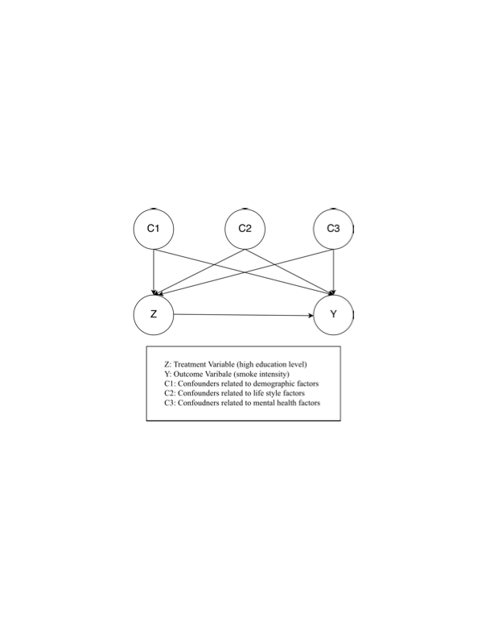
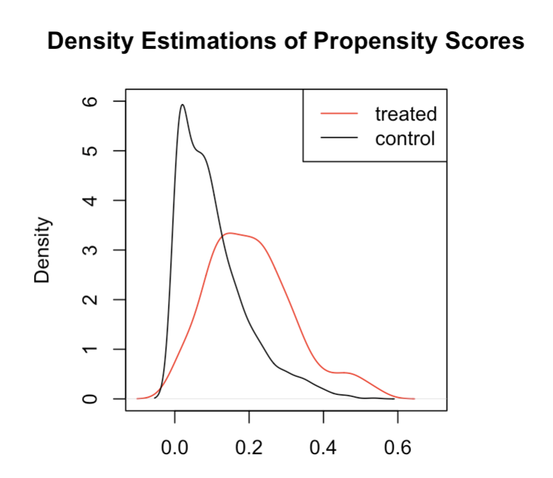
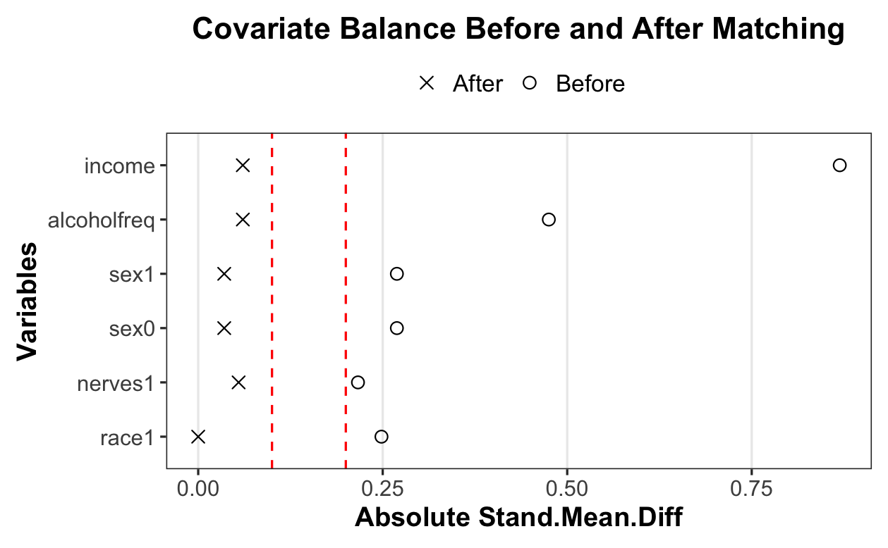

# The Effect of Education on Smoking Behavior

## Overview

This project examines whether attaining a higher level of education has a causal effect on subsequent smoking behavior. Using data from the National Health and Nutrition Examination Survey Epidemiologic Follow-up Study (NHEFS), we applied causal inference methods to estimate the effect of completing at least a college-level education on changes in smoking intensity.

**Research Question:** After adjusting for demographic, lifestyle and mental health covariates, does attaining a higher level of education (college) have a causal effect on the change of smoking behavior?

## Causal Framework

The treatment was defined as completing at least a college-level education by 1971, while the outcome was the change in cigarettes smoked per day between 1971 and 1982.

Potential confounders included age, sex, race, income, alcohol consumption frequency, and use of nerves medication.

<p align="center">
  
</p>

## Data

The analysis uses the `nhefs_complete` dataset from the R `causaldata` package.

- **Treatment:** Completion of at least a college-level education by 1971
- **Control:** Completion of less than a college-level education by 1971
- **Outcome:** Change in cigarettes smoked per day between 1971 and 1982
- **Covariates:** Age, sex, race, income, alcohol consumption frequency, and nerves medication use
- **Final sample:** 1,502 individuals, in which 172 are treated and 1,330 are controlled

## Methods

Two causal inference approaches were used to estimate the effect of education on smoking intensity:

### 1. Propensity Score Matching

Propensity scores were estimated using logistic regression based on pre-treatment covariates. Treated individuals were then paired with similar control individuals based on their estimated logit propensity scores.

Before matching, the overlap assumption was evaluated by comparing the propensity score distributions of the treatment and control groups.

<p align="center">
  
</p>

Covariate balance was evaluated before and after matching using standardized mean differences.

<p align="center">
  
</p>

### 2. Outcome Regression

Separate linear regression models were used to estimate potential outcomes under the treatment and control conditions. These predictions were used to estimate the Average Treatment Effect (ATE).

### 3. Sensitivity Analysis

A Rosenbaum sensitivity analysis was conducted to determine how strongly an unmeasured confounder would need to influence treatment assignment to alter the conclusions from the matching analysis.

## Results

The matching estimator yielded a mean difference of −3.53 cigarettes per day, while the outcome regression estimator produced an ATE of −4.01 cigarettes per day.

Both estimates suggest that individuals with at least a college-level education experienced a greater reduction in smoking intensity compared with individuals with lower levels of education.

However, the matching result became statistically insignificant at **Γ = 1.15** in the Rosenbaum sensitivity analysis, indicating that the findings may be sensitive to relatively modest unmeasured confounding.

## Conclusion

While both causal inference approaches produced consistent and statistically significant estimates, the sensitivity analysis showed that the findings were not highly robust to potential unmeasured confounding.

The project demonstrates the importance of evaluating causal assumptions and conducting robustness checks when drawing causal conclusions from observational data.

## Repository Structure

```text
.
├── README.md
├── analysis.Rmd
├── report.pdf
└── figures/
    ├── causal_plot.png
    ├── data_sample.png
    ├── data_summary_stat.png
    ├── loveplot.png
    ├── overlap.png
    └── treatment_distribution.png
```

## Full Report

For a detailed discussion of the methodology, assumptions, statistical inference, sensitivity analysis, and limitations, see the [full project report](report.pdf).
